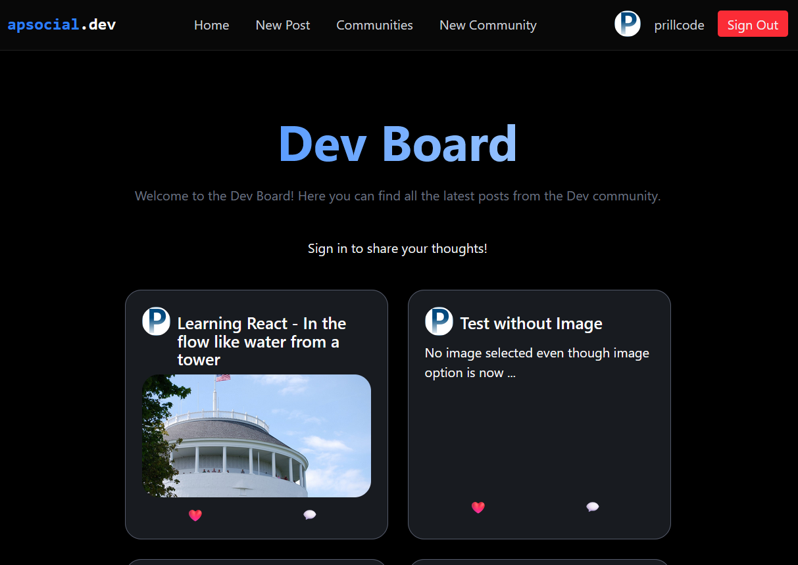

# socialweb  

## social media style web app (Reddit Clone) 
- React/Typescript with React Query and Auth SignIn with Github
- [Supabase](https://supabase.com) back-end.

Based on [this Youtube Tutorial](https://www.youtube.com/watch?v=_sSTzz13tVY)  

Screenshot of what I have so far:  

--  

